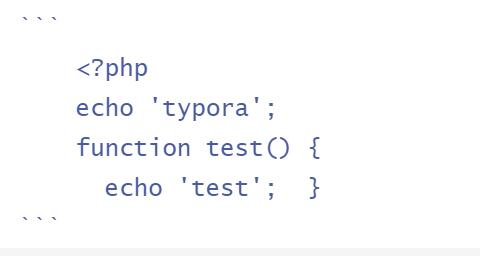

# Markdown 代码

如果是段落上的一个函数或片段的代码可以用反引号把它包起来（**`**）

```
`printf()`
```

`printf()`函数

----------

### 代码区块

代码区块使用 **4 个空格**或者一个**制表符（Tab 键**）

```
	<?php
    echo 'typora';
 	function test() {
 	  echo 'test'; 	}
```



用 **```** 包裹一段代码，并指定一种语言（也可以不指定）

```
​```javascript
$(document).ready(function () {
    alert('RUNOOB');
});
​```
```

```javascript
$(document).ready(function () {
    alert('RUNOOB');
});
```


