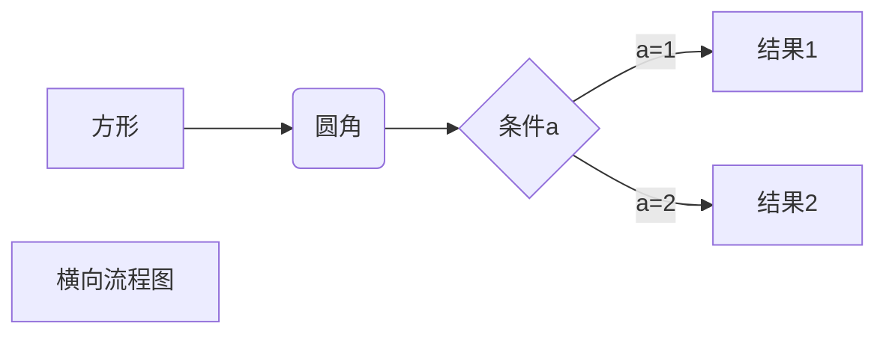
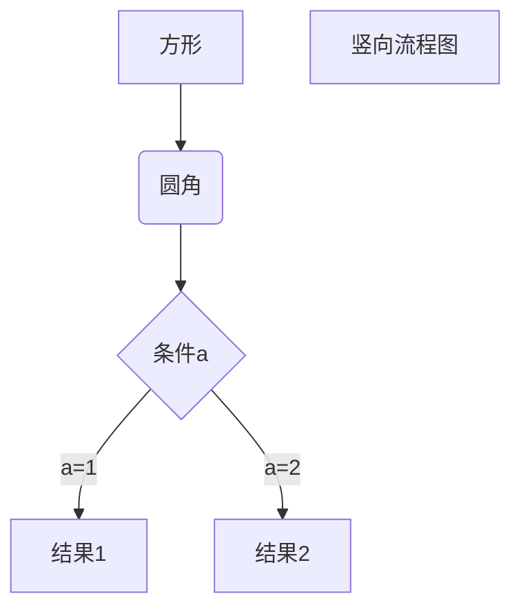

# Markdown 高级技巧

### 支持的 HTML 元素

不在 Markdown 涵盖范围之内的标签，都可以直接在文档里面用 HTML 撰写。

目前支持的 HTML 元素有：`<kbd> <b> <i> <em> <sup> <sub> <br>`等 

```
使用 <kbd>Ctrl</kbd>+<kbd>Alt</kbd>+<kbd>Del</kbd> 重启电脑
```

使用 <kbd>Ctrl</kbd>+<kbd>Alt</kbd>+<kbd>Del</kbd> 重启电脑

----

### 转义

Markdown 使用了很多特殊符号来表示特定的意义，如果需要显示特定的符号则需要使用转义字符，Markdown 使用反斜杠转义特殊字符

```
**文本加粗** 
\*\* 正常显示星号 \*\*
```

**文本加粗** 
\*\* 正常显示星号 \*\*

Markdown 支持以下这些符号前面加上反斜杠来帮助插入普通的符号

```
\   反斜线
`   反引号
*   星号
_   下划线
{}  花括号
[]  方括号
()  小括号
#   井字号
+   加号
-   减号
.   英文句点
!   感叹号
```

---------

### typora 画流程图、时序图(顺序图)、甘特图



```flow
st=>start: 开始框
op=>operation: 处理框
cond=>condition: 判断框(是或否?)
sub1=>subroutine: 子流程
io=>inputoutput: 输入输出框
e=>end: 结束框
st->op->cond
cond(yes)->io->e
cond(no)->sub1(right)->op
```
```sequence
对象A->对象B: 对象B你好吗?（请求）
Note right of 对象B: 对象B的描述
Note left of 对象A: 对象A的描述(提示)
对象B-->对象A: 我很好(响应)
对象A->对象B: 你真的好吗？
```
```sequence
Title: 标题：复杂使用
Typora->gitbook: gitbook你好吗?（请求）
Note right of gitbook: gitbook的描述
Note left of Typora: Typora的描述(提示)
gitbook-->Typora: 我很好(响应)
gitbook->github: 你好吗
github-->>Typora: gitbook找我了
Typora->gitbook: 你真的好吗？
Note over github,gitbook: 我们是朋友
participant node.js
Note right of node.js: 没人陪我玩
```

```mermaid
%% 语法示例
        gantt
        dateFormat  YYYY-MM-DD
        title 软件开发甘特图
        section 设计
        需求                      :done,    des1, 2019-11-16,1d
        原型                      :active,  des2, 3d
        UI设计                    :des3, after des2, 5d
        未来任务                   :des4, after des3, 5d
        section 开发
        学习准备理解需求             :crit, done, 2019-11-16,24h
        设计框架                    :crit, done, after des2, 2d
        开发                       :crit, active, 3d
        未来任务                    :crit, 5d
        耍                         :2d
        section 测试
        功能测试                    :active, a1, after des3, 3d
        压力测试                    :after a1  , 20h
        测试报告                    : 24h
```

**mermaid：**图中红框第一行内容与最后一行内容，表示当前使用的语言为mermaid。
**任务行：**

- **done** 已完成
- **active**正在进行
- **crit** 关键任务
**任务状态：**

**任务描述：**在des1、des2位置添加任务描述，其它任务引用时直接引用des1就可以。
 **after:** 描述任务时间关系。des3, after des2表示des3紧跟在des2之后。
 **任务时长有三种方式：**

-  **时间范围** 如：2014-01-06,2014-01-08
-  **指定天数** 如：5d
-  **指定开始日期+天数** 如：2014-01-06，5d